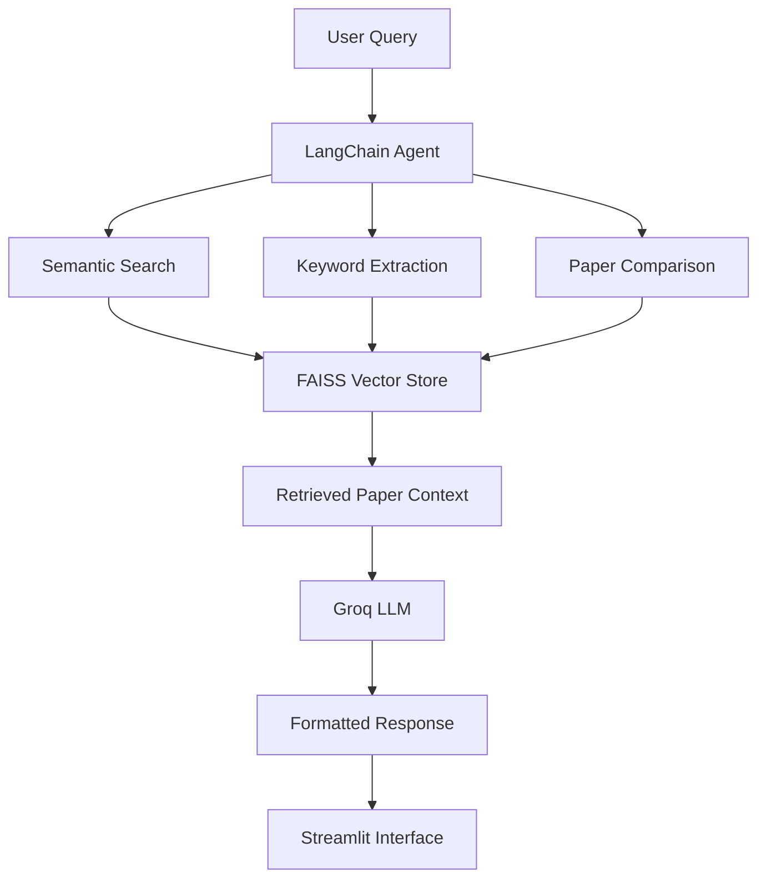

# 🤖 AI Research Paper Intelligence System

An AI-powered **Retrieval-Augmented Generation (RAG)** application that helps users search, summarize, extract insights from, and compare research papers using semantic search. The application combines **FAISS vector search**, **Sentence Transformers**, **LangChain agents**, and **Groq LLMs** to provide fast and context-aware responses through an intuitive **Streamlit** interface.

---

## 🚀 Features

- 🔍 **Semantic Paper Search**
  - Find relevant research papers using vector similarity instead of exact keyword matching.

- 📝 **Paper Summarization**
  - Generate concise summaries of retrieved papers using Groq LLM.

- 🏷️ **Keyword Extraction**
  - Automatically identify important concepts and research topics.

- ⚖️ **Paper Comparison**
  - Compare multiple research papers side-by-side to understand similarities and differences.

- 🤖 **Agent-Based Tool Routing**
  - LangChain automatically selects the appropriate tool based on the user's query.

- ⚡ **Fast Vector Retrieval**
  - Uses FAISS indexing for efficient similarity search across research papers.

- 🎨 **Modern Streamlit Interface**
  - Clean UI with custom styling and responsive layout.

---

# 🏗️ System Architecture



---

# ⚙️ How It Works

### Step 1 — User Query

The user enters a research-related question in the Streamlit interface.

Example:

> Compare recent papers on Vision Transformers with CNN architectures.

---

### Step 2 — Intelligent Routing

A LangChain agent analyzes the query and determines which tool should be executed.

Available tools include:

- Semantic Search
- Keyword Extraction
- Paper Comparison

---

### Step 3 — Semantic Retrieval

The selected tool searches the FAISS vector database using SentenceTransformer embeddings.

Embedding Model:

```
all-MiniLM-L6-v2
```

Top-k relevant papers are retrieved.

---

### Step 4 — Context Generation

The retrieved abstracts are injected into the prompt as context for the Groq LLM.

---

### Step 5 — Response Generation

Groq generates:

- summaries
- comparisons
- extracted keywords
- explanations

which are then displayed in the Streamlit application.

---

# 🛠️ Tech Stack

| Category | Technologies |
|-----------|--------------|
| Language | Python |
| Frontend | Streamlit |
| LLM | Groq |
| Framework | LangChain |
| Vector Database | FAISS |
| Embeddings | Sentence Transformers |
| Data Processing | Pandas, NumPy |
| Environment | Python Dotenv |

---

# 📁 Project Structure

```
AI-Research-Paper-Intelligence/
│
├── app.py
├── .env
├── processed_papers.csv
├── paper_faiss.index
├── README.md
│
└── assets/
    ├── home.png
    ├── search.png
    └── compare.png
```

---

# 📦 Installation

## 1. Clone the Repository

```bash
git clone https://github.com/yourusername/AI-Research-Paper-Intelligence.git

cd AI-Research-Paper-Intelligence
```

---

## 2. Create a Virtual Environment

### Windows

```bash
python -m venv venv

venv\Scripts\activate
```

### Linux / macOS

```bash
python3 -m venv venv

source venv/bin/activate
```

---

## 3. Install Dependencies

```bash
pip install -r requirements.txt
```

If a requirements file is unavailable:

```bash
pip install streamlit
pip install pandas
pip install numpy
pip install faiss-cpu
pip install sentence-transformers
pip install langchain
pip install langchain-groq
pip install python-dotenv
```

---

## 4. Configure Environment Variables

Create a `.env` file in the project root.

```env
GROQ_API_KEY=your_groq_api_key
```

---

## 5. Prepare the Dataset

The project expects two files:

### processed_papers.csv

Contains research paper metadata.

Required columns:

```
title
abstract
```

### paper_faiss.index

Pre-built FAISS vector index generated using the same embedding model.

---

# ▶️ Run the Application

```bash
streamlit run app.py
```

The application will be available at

```
http://localhost:8501
```

---

# 📊 Workflow

```
User Query
      │
      ▼
LangChain Agent
      │
      ▼
Select Appropriate Tool
      │
      ▼
FAISS Similarity Search
      │
      ▼
Retrieve Top Papers
      │
      ▼
Generate Context
      │
      ▼
Groq LLM
      │
      ▼
Formatted Response
      │
      ▼
Streamlit UI
```

---

# 📸 Screenshots

## Home Page

> Add screenshot here

```
assets/home.png
```

---

## Search Results

> Add screenshot here

```
assets/search.png
```

---

## Paper Comparison

> Add screenshot here

```
assets/compare.png
```

---

# 📈 Future Improvements

- 📄 Upload and analyze custom PDF research papers
- 🔗 Citation generation (APA, IEEE)
- 🌐 Multi-language paper summarization
- 📚 Hybrid Retrieval (BM25 + FAISS)
- 🎯 Cross-Encoder reranking
- 💬 Conversational memory for follow-up questions
- ☁️ Deploy on Streamlit Cloud
- 🧠 Support for larger embedding models

---

# 🤝 Contributing

Contributions are welcome!

1. Fork the repository.
2. Create a feature branch.

```bash
git checkout -b feature-name
```

3. Commit your changes.

```bash
git commit -m "Add new feature"
```

4. Push to GitHub.

```bash
git push origin feature-name
```

5. Open a Pull Request.

---

# 📜 License

This project is licensed under the MIT License.

See the `LICENSE` file for more information.

---

# 👨‍💻 Author

**Aanya Mahajan**

Computer Science Engineering Student

Interested in:

- Artificial Intelligence
- Machine Learning
- Large Language Models
- Retrieval-Augmented Generation (RAG)
- Full Stack Development

---

## ⭐ Support

If you found this project useful, consider giving it a ⭐ on GitHub.

It helps others discover the project and motivates further development.
